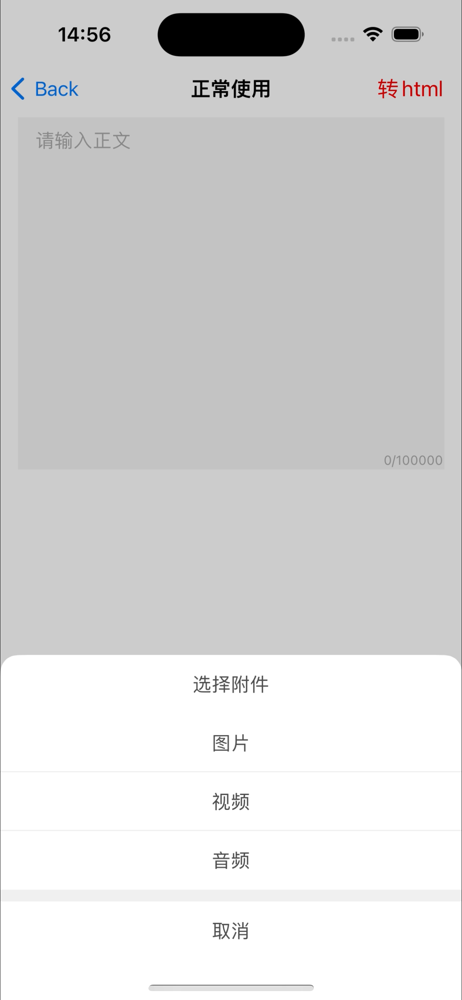
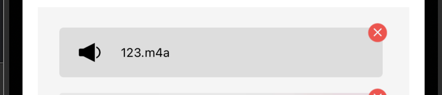
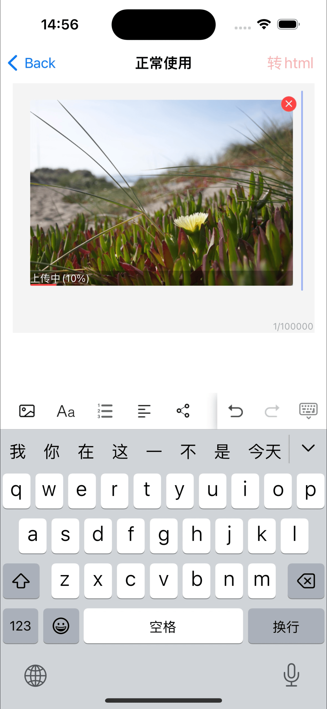
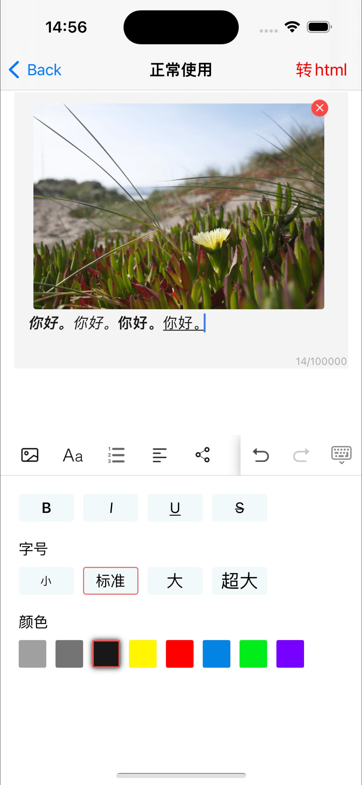
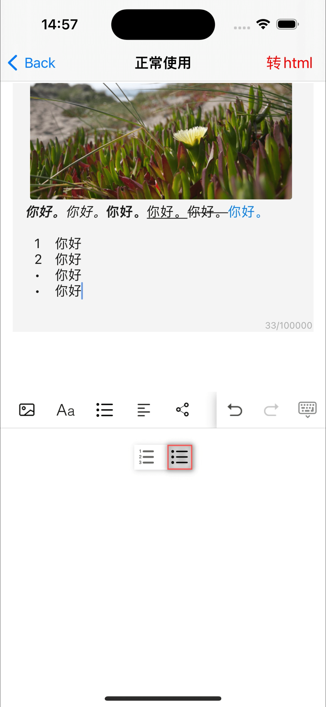
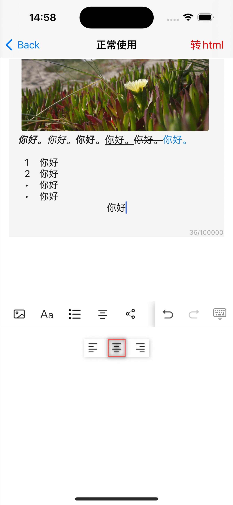
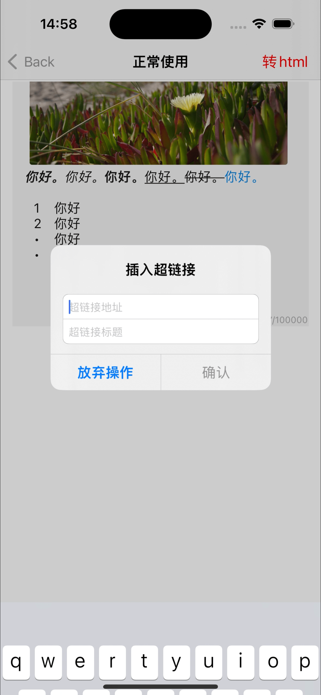

# RZRichTextView

[](https://travis-ci.org/rztime/RZRichTextView)
[](https://cocoapods.org/pods/RZRichTextView)
[](https://cocoapods.org/pods/RZRichTextView)
[](https://cocoapods.org/pods/RZRichTextView)

## Example

To run the example project, clone the repo, and run `pod install` from the Example directory first.

## Requirements

## Installation

RZRichTextView is available through [CocoaPods](https://cocoapods.org). To install
it, simply add the following line to your Podfile:

```ruby
pod 'RZRichTextView'
```

有时可能会有一些小更新但暂时没有更新最新版本，可以在podfile中使用
```ruby
pod 'RZRichTextView', :git => 'https://github.com/rztime/RZRichTextView.git'
```

然后执行
```ruby
pod update RZRichTextView --no-repo-update
```


## Author

rztime, rztime@vip.qq.com qq交流群：580839749

## License

RZRichTextView is available under the MIT license. See the LICENSE file for more info.


# 简介

RZRichTextView继承UITextView，实现富文本编辑功能。使用Swift完成，基本所有的方法和属性都是公开的，方便继承或自定义修改，如果OC项目使用，可以使用桥接。

另外，请参考[UpdataLog](UpdataLog.md),里边有更新信息说明，版本对应相应的tag

示例图片在最下边


# 说明


#### 支持的功能

    . 插入图片、视频、音频
    . 字体样式（粗体，斜体，下划线，删除线、大小、颜色）等等，如有其他需求，可以轻松自定义
    . 支持有序无序列表
    . 支持段落对齐方式
    . 支持链接的输入和编辑
    . 引用块的功能（注释了，和列表存在冲突）

# 功能说明

#### 依赖库
    SnapKit:用于设置自动布局
    [QuicklySwift](https://github.com/rztime/QuicklySwift):我自己写的方便swift使用的库
    [RZColorfulSwift](https://github.com/rztime/RZColorfulSwift):富文本 
    Kingfisher: 用于重新编辑时，拉取图片


#### 使用方法

  [HowToUseDemo](./Example/RZRichTextView/HowToUseDemo.swift)

```swift
将Demo里的HowToUseDemo里的代码复制到自己的项目中，根据需求，配置viewModel相关信息，另外完成里边FIXME相关：
1.preview:  预览功能需要自己实现，
2.upload:  上传音视频、图片的功能需要自己实现
3.音视频图片的选择: 需要自己实现音视频、图片的选择
```

初始化的时候，需要设置frame.width，
这是因为如果重新编辑时，富文本要设置音视频图片宽度的时候，避免拿不到
```
let textView = RZRichTextView.init(frame: .init(x: 15, y: 0, width: qscreenwidth - 30, height: 300), viewModel: .shared())
    .qbackgroundColor(.qhex(0xf5f5f5))
    .qplaceholder("请输入正文")
```

图片的加载方法，请参考HowToUseDemo，RZRichTextView项目里去掉了相关的图片加载方法，全部放在HowToUseDemo的configure里，是为了适配@MainActor，如果有必要，可以在外边添加@MainActor

#### upload 上传

需要通过设置info?.uploadStatus来绑定上传进度，上传完成后，需要写入src、poster

```swift
case .upload(let info): // 上传 以及点击重新上传时，将会执行
    // FIXME: 此处自行实现上传功能，通过info获取里边的image、asset、filePath， 上传的进度需要设置到info.uploadStatus
    UploadTaskTest.uploadFile(id: info, testVM: info) { [weak info] progress in
        if progress < 1 {
            info?.uploadStatus.accept(.uploading(progress: progress))
        } else {
            info?.uploadStatus.accept(.complete(success: true, info: "上传完成"))
            switch info?.type ?? .image {
            case .image: info?.src = "/Users/rztime/Downloads/123.jpeg"
            case .audio: info?.src = "/Users/rztime/Downloads/123.m4a"
            case .video:
                info?.src = "/Users/rztime/Downloads/123.mp4"
                info?.poster = "/Users/rztime/Downloads/123.jpeg"
            }
        }
    }

```

判断富文本中的音视频图片是否全部上传完成

```swift
let success = textView.viewModel.uploadAttachmentsComplete.value
// true 表示全部上传完成，没有音视频图片时，默认true
```

#### 插入音视频、图片

选择音视频图片之后，生成`RZAttachmentInfo`，插入textView
```swift
/// let info = RZAttachmentInfo.init(type: .audio, image: nil, asset: nil, filePath: "file:///Users/rztime/Downloads/123.m4a", maxWidth: viewModel.attachmentMaxWidth, audioHeight: viewModel.audioAttachmentHeight)
/// 视频需包含首帧图
/// let info = RZAttachmentInfo.init(type: .video, image: image, asset: asset, filePath: nil, maxWidth: viewModel.attachmentMaxWidth, audioHeight: viewModel.audioAttachmentHeight)
let info = RZAttachmentInfo.init(type: .image, image: image, asset: asset, filePath: nil, maxWidth: viewModel.attachmentMaxWidth, audioHeight: viewModel.audioAttachmentHeight)
/// 插入资源
viewModel.textView?.insetAttachment(info)
```
    
在`RZAttachmentInfo.swift`中给NSTextAttachment添加了一个属性**rzattachmentInfo**:
**RZAttachmentInfo**，包含了**音视频图片相关信息，以及上传完成之后的信息，以及用于显示相关数据的遮罩view**

#### 编辑器核心方法

```
/// 字体样式
1.reloadText() /// 修改textView.typingAttributes 之后，只需要调用此方法，即可刷新所在区域样式
/// 段落样式
2.reloadParagraphStyle() /// 修改了textView.typingAttributes里的paragraphstyle之后，只需要调用此方法，即可刷新所在区域段落样式
/// 列表（有序无序样式）
3.reloadTextByUpdateTableStyle() /// 修改了textView.typingAttributes里的paragraphstyle的列表样式之后，只需要调用此方法，即可刷新所在区域段落样式

```

#### 自定义

* 在`RZRichTextViewModel`里,各种数组可以重新设置，用于修改工具栏样式.
* 在`RZInputAccessoryType`里，预留了custom1-20, 用于自定义功能
* 自定义显示音视频图片在textView中显示的视图，参考`RZAttachmentInfoLayerView`

示例
```
    let viewModel = RZRichTextViewModel.shared()
    viewModel.inputItems.insert(.init(type: .custom1, image: UIColor.red.qtoImage(.init(width: 23, height: 23)), highlight:  UIColor.blue.qtoImage(.init(width: 23, height: 23))), at: 0)
    
    lazy var textView = RZRichTextView.init(frame: .init(x: 15, y: 0, width: qscreenwidth - 30, height: 300), viewModel: viewModel)
    .qbackgroundColor(.qhex(0xf5f5f5))
    .qplaceholder("请输入正文")

// 最后在viewModel.didClickedAccessoryItem里实现custom1的功能
```

# NSAttributedString 到 HTML

[RZHtml.swift](./RZRichTextView/Classes/RZHtml.swift)

```
let html = textView.code2html()
```

```
let html = attributedText.code2html()
```

# HTML 到 NSAttributedString

[RZHtml.swift](./RZRichTextView/Classes/RZHtml.swift)

1.RZRichTextView
```
textView.html2Attributedstring(html: html)
```

2.UILabel

```
Label.html2AttributedString(html: html) { [weak self] in
    // label里的富文本图片改变，此时内容高度会有变化，可以按需更新高度
    if let self = self {
        self.reload?(self.indexPath)
    }
} preview: { tapActionId in
    if tapActionId.hasPrefix("<NSTextAttachment") {
        print("预览附件:\(tapActionId)")// 通过富文本，获取所有的附件，然后预览
    } else {
        print("处理链接:\(tapActionId)")
    }
}
```

3.String
```
let attr = html?.html2Attributedstring(options: .defaultForLabel(200, 60), loadAttachments: { infos in
   // 参考textView或者UILabel里的实现
})
```

## 关于生成的HTML

生成的内容，以行内样式生成，未使用系统原生方法，
即类似：
```
<p style="font-size:16px;"><u>文本</u></p>
```

## 示例图片

1.选择音视频图片



2_1.音频



2.上传中



3.字体样式



4.列表



5.段落样式



6.链接样式



7.生成的html


