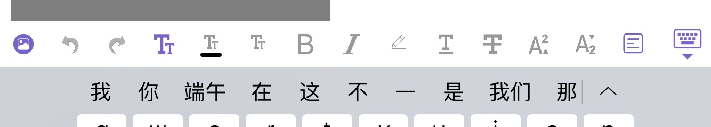
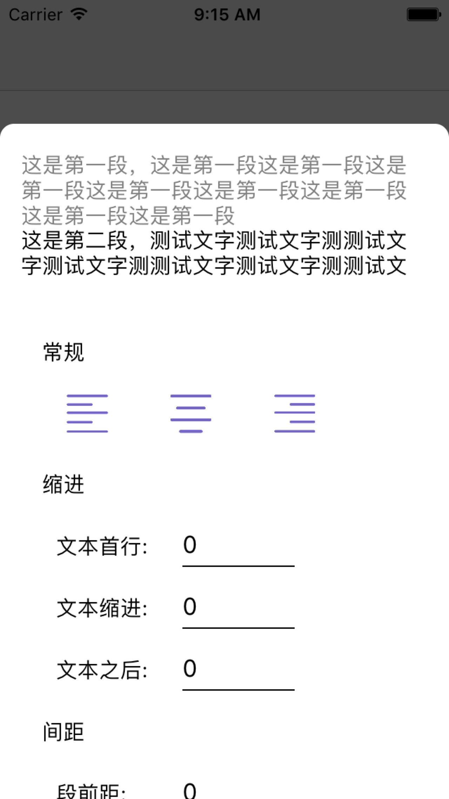
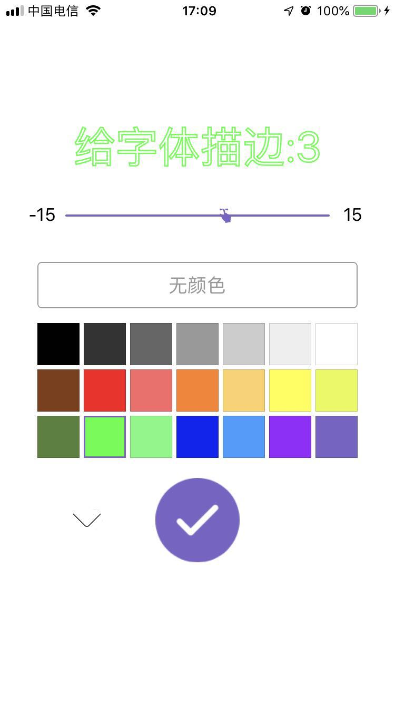
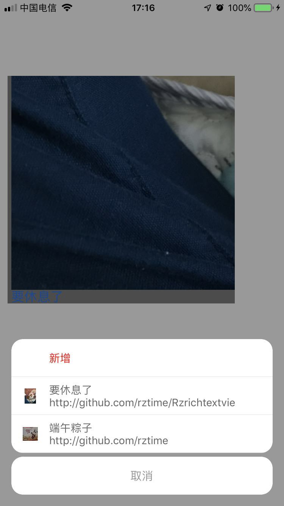

# RZRichTextView


###### [更新日志](https://github.com/rztime/RZRichTextView/blob/master/UpdateLog.md)

导入工程

```objc
pod 'RZRichTextView'
```

需要使用的地方

```objc
#import <RZRichTextView/RZRichTextView.h>
```

* RZRichTextView 继承自UITextView

* 富文本编辑器，支持html与文本相互转换，支持的功能如下 
    * 插入图片
    * 撤销
    * 恢复
    * 字体 （大小、颜色、背景色、粗体、斜体、描边）
    * 下划线
    * 删除线
    * 上标
    * 下标
    * 段落样式（对齐、缩进、间距）
    * 文字拉伸
    * 阴影
    * 链接（文字、图片）
    

### 插入图片到富文本之后，在转换成HTML标签之前，需要将图片上传至服务器得到URL，最后将URL替换图片之后，生成HTML标签

* 如果要对插入的图片进行处理，请实现

```objc
    // 全局的图片的处理
    RZRichTextConfigureManager.manager.rz_shouldInserImage = ^UIImage * _Nullable(UIImage * _Nullable image) {
        return image;
    }
```

### [** 如果开发者需要代码预填入内容，或将html标签解析成富文本重新写入到文本中，继续编辑，请参考RZColorful **](https://github.com/rztime/RZColorful)
<p align="center" >

</br>所支持的工具条</br></br>
</p>

<p align="center" >

</br>段落样式设置</br></br>
</p>


<p align="center" >

</br>描边功能设置</br></br>
</p>


<p align="center" >

</br>多个链接时选择编辑</br></br>
</p>


<p align="center" >

</br>链接编辑</br></br>
</p>


### 使用RZRichTextView文本框

```objc
/**
获取输入框中的所有图片

@return 按照图片插入顺序排列
*/
- (NSArray <UIImage *> *)rz_rictTextImages;
```

```objc
/**
将富文本内容转换成HTML标签语言 urls需与图片顺序、数量一致（倒叙方式插入，缺失可能导致图片顺序不准确）

@param urls 图片的链接，如果有图片，则请将图片先上传至自己的服务器中，得到地址。然后在转换成HTML时，urls图片顺序将与[- (NSArray <UIImage *> *)rz_rictTextImages]方法得到的图片顺序一致
@return HTML标签string。
*/
- (NSString *)rz_codingToHtmlWithImageURLS:(NSArray <NSString *> *)urls;

```

在iOS 13中，Light/Dark模式适配

```objc
RZRichTextConfigureManager的overrideUserInterfaceStyle属性，默认跟随系统
UITextView的overrideUserInterfaceStyle，跟随RZRichTextConfigureManager的overrideUserInterfaceStyle的属性
            
[注意]：
如果设置 textView.overrideUserInterfaceStyle属性，将会修改RZRichTextConfigureManager的overrideUserInterfaceStyle，
所以在textView使用完成之后，按需要去还原RZRichTextConfigureManager的overrideUserInterfaceStyle的默认属性
```
### 使用NSAttributedString
包含文件
```objc
#import <RZColorful/RZColorful.h> // #import <RZColorful/NSAttributedString+RZColorful.h> 
```
在NSAttributedString中

#pragma mark - HTML 富文本互换

```objc
// 将html转换成 NSAttributedString
+ (NSAttributedString *)htmlString:(NSString *)html;
```

```objc
// 获取富文本中的图片 用于上传服务器
- (NSArray <UIImage *> *)rz_images;
```

```objc
/**
将富文本编码成html标签，如果有图片，用此方法

@param urls 图片的url，url需要先获取图片，然后自行上传到服务器，最后按照【- (NSArray <UIImage *> *)images;】此方法得到的图片顺序排列url
@return HTML标签
*/
- (NSString *)rz_codingToHtmlWithImagesURLSIfHad:(NSArray <NSString *> *)urls;
```

```objc
/**
将富文本完整的code成html标签，（此方法如果富文本中有图片，则图片将被丢失）  有图片时，请用[rz_codingToHtmlWithImagesURLSIfHad]方法

@return HTML标签语言
*/
- (NSString *)rz_codingToCompleteHtml;
```


# 自定义RZRichTextView的功能

* 富文本主要是对NSAttributedString的属性进行各式设置，然后和text合并起来，最后形成富文本

#### 自定义 工具条
<p align="center" >

工具条
</p>

###### 工具条是一个UICollectionView，所以要自定义功能，需要实现以下四个方法 
* 1.cell  注册  

``` objc
// [RZRichTextConfigureManager manager]
/** 自定义 注册的键盘上的工具条的cell */
- (void)registerRZRichTextAttributeItemClass:(Class)classNa forAccessoryItemCellWithIdentifier:(NSString *)identifier;
```

* 2.dataSouce
    
``` objc
// [RZRichTextConfigureManager manager]
/** 键盘上的工具条功能数组，可新增、删除、交换顺序
如果要添加自定义的功能，添加的RZRichTextAttributeType 请尽量从100以后添加，
*/
@property (nonatomic, copy) NSMutableArray <RZRichTextAttributeItem *> *rz_attributeItems;
```

* 3.cell的初始化

```objc
// [RZRichTextConfigureManager manager]
/** 根据item，可自定义键盘工具栏的功能cell 不需要自定义时，return nil; （在工具条刷新的时候会调用）*/
@property (nonatomic, copy) UICollectionViewCell *(^cellForItemAtIndePath)(UICollectionView *collectionView, NSIndexPath *indexPath, RZRichTextAttributeItem *item);
```

* 4.cell的点击事件

```objc
// [RZRichTextConfigureManager manager]
/** 点击了某个功能， 需要自定义处理时，返回YES*/
@property (nonatomic, copy) BOOL(^didClickedCell)(RZRichTextView *textView, RZRichTextAttributeItem *item);
```
    
##### 以上修改是针对全局的RZRichTextView的功能
#### 在配置了全局的RZRichTextView的功能，也可以在RZRichTextView初始化之后，单独对某一个RZRichTextView进行定制，RZRichTextView同样有2、3、4方法，当实现了之后，[RZRichTextConfigureManager manager]的2、3、4全局的自定义方法将以RZRichTextView为主

### 自定义方法，是对[RZRichTextView rz_attributedDictionays]的字典里的内容的修改，所以如需自定义，请在4.cell的点击事件中进行处理
### 完成rz_attributedDictionays修改之后，需要

```objc
// RZRichTextView
/**
 刷新工具条的cell
 */
- (void)rz_reloadAttributeData;
```

