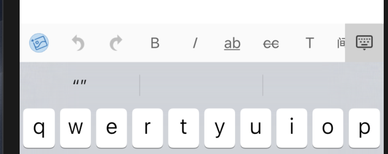
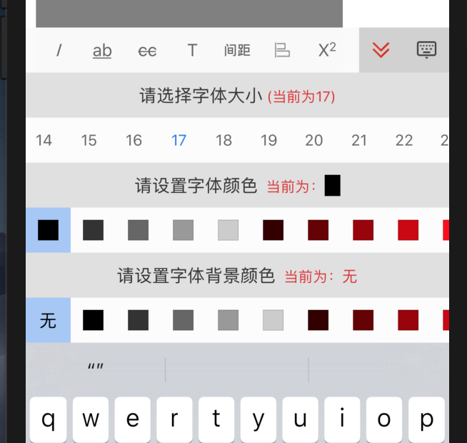
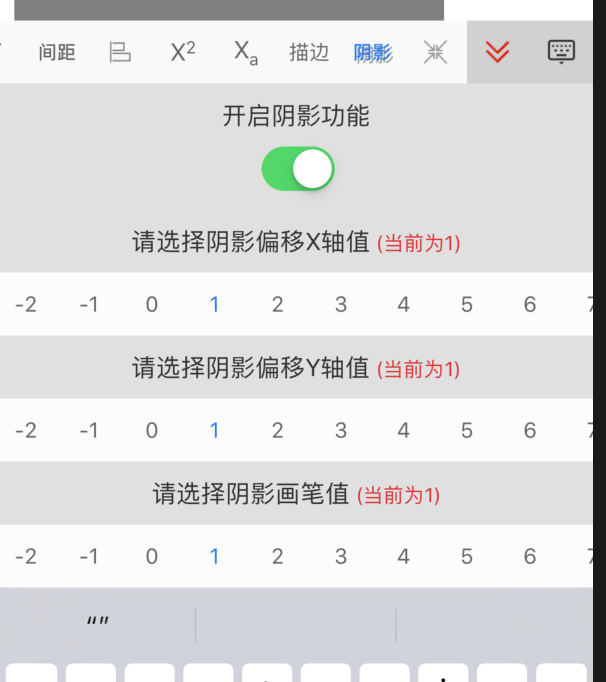

# RZRichTextView


可以直接添加

```objc
pod 'RZRichTextView'
```

* UITextView 富文本编辑器

* RZRichTextView 继承自UITextView

* 富文本编辑器，支持html与文本相互转换，支持的功能如下

    * 插入图片
    * 撤销
    * 恢复
    * 粗体
    * 斜体
    * 下划线
    * 删除线
    * 字体大小、颜色、字体背景色设置
    * 字间距
    * 对齐方式
    * 上标
    * 下标
    * 文字描边 （画笔大小、颜色）
    * 文字阴影 （画笔大小、偏移量、颜色）
    * 文字拉伸
    

* 插入图片到富文本之后，在转换成HTML标签之前，需要将图片上传至服务器得到URL，最后将URL替换图片之后，生成HTML标签


<p align="center" >

</p>
<p align="center" >

</p>
<p align="center" >

</p>

### 使用RZRichTextView文本框
```objc
/**
获取输入框中的所有图片

@return 按照图片插入顺序排列
*/
- (NSArray <UIImage *> *)rz_rictTextImages;
```

```objc
/**
将富文本内容转换成HTML标签语言 urls需与图片顺序、数量一致（倒叙方式插入，缺失可能导致图片顺序不准确）

@param urls 图片的链接，如果有图片，则请将图片先上传至自己的服务器中，得到地址。然后在转换成HTML时，urls图片顺序将与[- (NSArray <UIImage *> *)rz_rictTextImages]方法得到的图片顺序一致
@return HTML标签string。
*/
- (NSString *)rz_codingToHtmlWithImageURLS:(NSArray <NSString *> *)urls;

```

### 使用NSAttributedString
包含文件
```objc
#import <RZColorful/RZColorful.h> // #import <RZColorful/NSAttributedString+RZColorful.h> 
```
在NSAttributedString中

#pragma mark - HTML 富文本互换

```objc
// 将html转换成 NSAttributedString
+ (NSAttributedString *)htmlString:(NSString *)html;
```

```objc
// 获取富文本中的图片 用于上传服务器
- (NSArray <UIImage *> *)rz_images;
```

```objc
/**
将富文本编码成html标签，如果有图片，用此方法

@param urls 图片的url，url需要先获取图片，然后自行上传到服务器，最后按照【- (NSArray <UIImage *> *)images;】此方法得到的图片顺序排列url
@return HTML标签
*/
- (NSString *)rz_codingToHtmlWithImagesURLSIfHad:(NSArray <NSString *> *)urls;
```

```objc
/**
将富文本完整的code成html标签，（此方法如果富文本中有图片，则图片将被丢失）  有图片时，请用[rz_codingToHtmlWithImagesURLSIfHad]方法

@return HTML标签语言
*/
- (NSString *)rz_codingToCompleteHtml;
```


